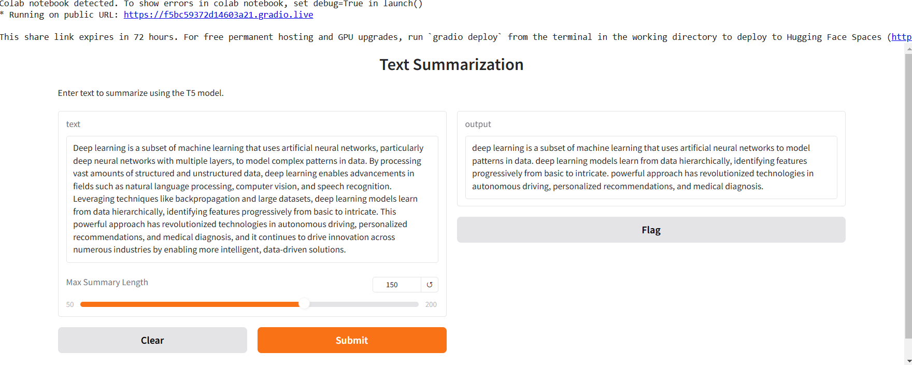

# Text-Summarization-with-T5
This project implements a text summarization application using the T5 transformer model. The application allows users to input text and receive a summarized version of the content.
## Features
- Uses T5 model for effective text summarization
- Provides a web interface using Gradio
- Allows control over the summary length
## Installation
1. clone the Repository
   - git clone [https://github.com/Seetha-2002/Text-Summarization-with-T5](https://github.com/Seetha-2002/Text-Summarization-with-T5)
2. Install dependencies
   - pip install -r [requirements.txt](requirements.txt)
## Usage
Run the application:
-[main.py](main.py)
Access the Gradio interface in your browser to interact with the model.
## Requirements
- transformers
- torch
- gradio
## Acknowledgments
- Hugging Face for the T5 model
- Gradio for the easy-to-use web interface
## Example
- 

